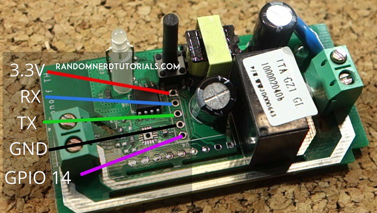

# SonoffClassic


```
  - platform: mqtt
    name: 'Luce ingresso principale'
    state_topic: 'A89F9D/switch/state'
    command_topic: 'A89F9D/switch/switch'
    optimistic: false
    retain: true
``` 

Sonoff schematics pinout:

